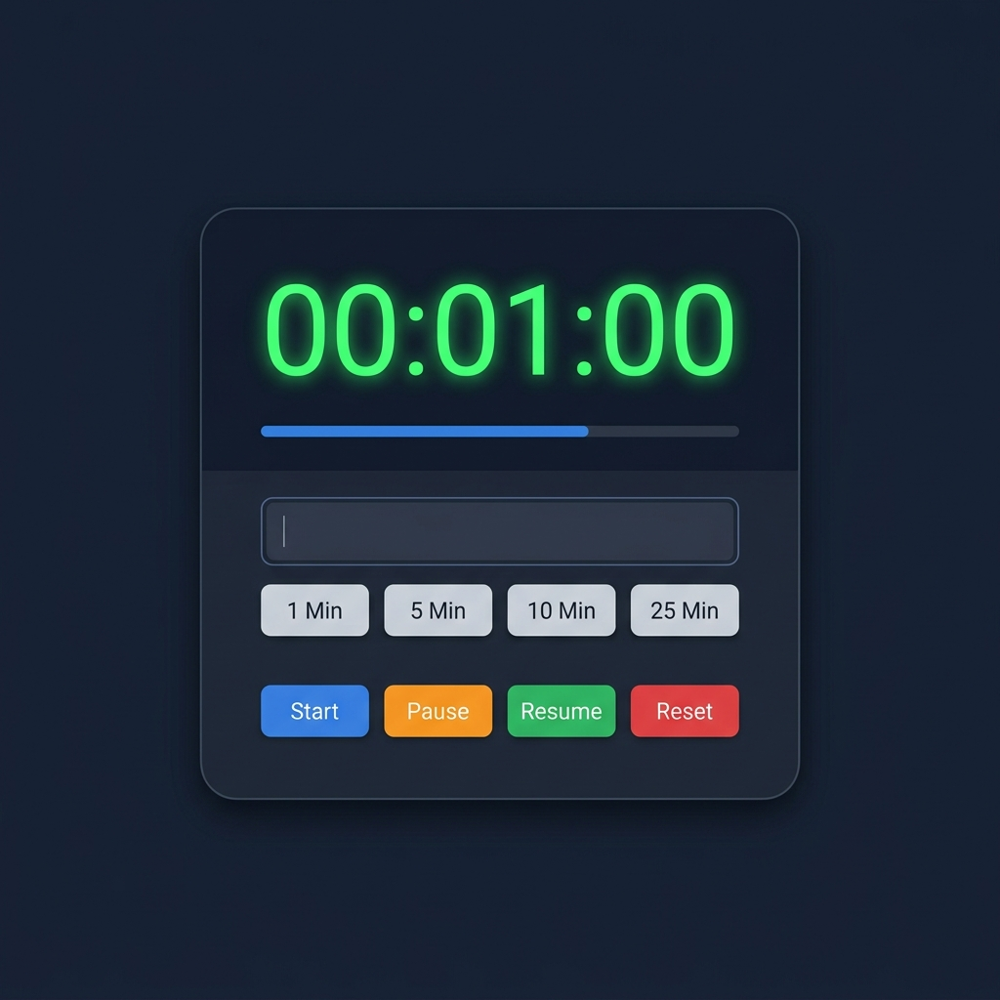

#  Focus & Countdown Timer (Premium Productivity Desk)

A premium, high-fidelity desktop productivity dashboard built with Python and Tkinter. Overhauled from a simple countdown timer into a feature-rich focus station, featuring a beautiful custom **Circular Progress Canvas**, a fully-automated **Pomodoro Mode**, dynamic live **Themes**, mechanical tick-tock audio options, customizable alert profiles, and persistent configuration.



---

##  Upgraded Features

- ** Circular Progress Canvas**: A gorgeous, custom-rendered canvas progress ring. It features a background track, a dynamic active progress arc, and high-contrast status colors.
- ** Pomodoro focus engine**: Switch to Pomodoro mode with a single click to enter a standard deep focus loop:
  - **Focus Round (25 mins)** -> **Short Break (5 mins)** (4 cycles total)
  - **Long Break (15 mins)** after completing all 4 focus rounds.
  - Automatically tracks completed rounds with beautiful visual indicators (green dots).
- ** Dynamic Live Themes**: Shift styles in real-time with five curated, professional palettes:
  -  **Slate Dark** (Default modern developer dark mode)
  -  **Cyberpunk Neon** (Deep purples with vivid hot pink and cyan neon details)
  -  **Forest Green** (Dark forest background with soft moss and emerald tones)
  -  **Sunset Glow** (Warm crimson dark theme with deep magenta and warm gold accents)
  -  **Crisp Light** (A pristine, high-contrast, modern clean light theme)
- ** Drift-Free Precision Timing**: Re-engineered using `time.monotonic()` absolute system clock calculations, eliminating typical millisecond accumulation lag found in standard event ticks.
- ** Custom Presets & Config Persistence**: Save your most used countdown times to your presets tray with a single `+` click. Saved configurations, tick-tock choices, and alert styles are stored in `.timer_config.json`.
  - *Tip: Right-click any preset button in the tray to delete it instantly.*
- ** Audio Settings Deck**:
  - **Clock Tick-Tock**: Toggle a soft mechanical click sound that ticks each second, providing a tactile focus environment.
  - **Buzzer Melodies**: Choose your alert style:
    - *Standard* (3 crisp beeps)
    - *Chime* (An elegant rising melody)
    - *Siren* (Rapid alert pulses)
    - *Silent* (Visual flash alerts only)
- ** Smart Keyboard Shortcuts**: Complete hands-free controls. Key binds are intelligently muted when you are actively typing inside the time entry field.

---

##  Keyboard Shortcuts

Easily control your sessions without taking your hands off the keyboard:

| Action | Shortcut Key | Description |
| :--- | :---: | :--- |
| **Start / Resume** | `Enter` | Starts the timer or resumes from pause |
| **Play / Pause / Resume** | `Spacebar` | Toggles timer play state (ignored if typing in setting entry) |
| **Reset** | `R` or `r` | Resets the timer back to its initial ready state (ignored if typing) |

---

##  Custom Presets Management

1. Type any custom interval in the entry (e.g. `90` for 90 seconds, `10:00` for 10 minutes, or `01:15:00` for 1 hour and 15 mins).
2. Click the `+` button in the preset row to append it to the presets tray.
3. To remove any custom preset, simply **right-click** its button in the tray.

---

##  Tech Stack & Requirements

- **Python 3.10+** (Tested with Python 3.11/3.12)
- **Tkinter** (Python's native GUI framework)
- **Zero External Dependencies**: Standard library modules only (`tkinter`, `time`, `json`, `math`, `sys`). Runs anywhere out-of-the-box!

---

##  Getting Started

Simply run the application file:

```bash
python countdown.py
```
